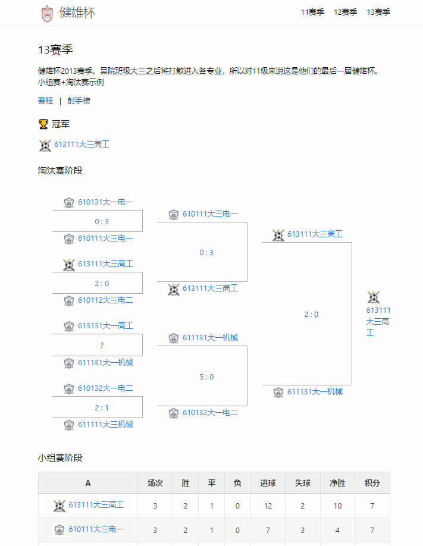
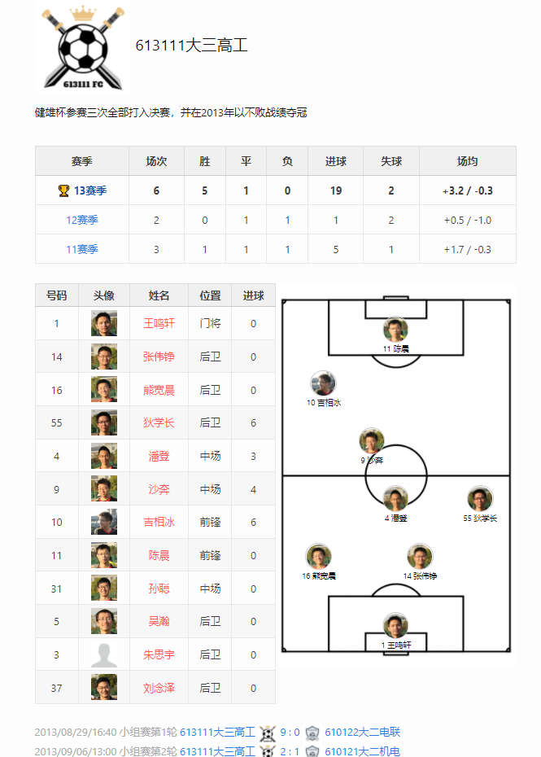

# 超业余足球联赛网站生成器
# Super Unprofessional League Website Generator

By shrekshao狄学长

[EN](docs/EN.md) | [简体中文](#)

[示例](https://super-unprofessional-league.github.io/soccer-website-generator/)

一个基于Jekyll的静态网站生成器，专为建造超业余足球联赛网站定制，适用于校园内赛事，社区联赛等。 






已支持以下功能：
* 多个赛季
    - 联赛（传统积分榜，积分等数据根据比赛信息自动计算）
    - 杯赛（小组赛积分榜 + 淘汰赛树状图）
* 比赛页面
    - 比分
    - 各类信息: 日期, 点球决胜，弃权等
    - 比赛事件
        - 进球
        - 乌龙球
        - 点球
        - 红黄牌
        - 换人
        - 照片
        - 视频外链嵌入
* 球员数据榜
    - 射手榜（进球数根据比赛信息自动计算）
* 队伍页面
    - 球员列表
    - 首发阵容
    - 照片
* 语言翻译支持
* 战报，新闻，通知等文章发布


## 快速开始

* 安装 [Jekyll](https://jekyllrb.com/docs/) (参考Jekyll官方文档)
* `bundle install`
* 开发状态下 `bundle exec jekyll serve`
* 生成网站 `bundle exec jekyll build` （`_site/`下）
* `_site/` 目录下 `git init`, push 到 github上或其他服务商来部署（参考 github page 文档等）
    * 注意：因为项目使用了自定义Jekyll plugin所以无法使用github自带的自动生成


## 添加你的联赛数据

所有比赛相关数据在 `_data/` 目录下

所有静态文件（照片等）置于 `assets/` 目录下

### _data 数据结构示例

* _data
    - seasons
        - 2018-2019
            - config.json (可选，若无则默认为联赛模式)
            - teams
                * bayern.json
                * dortmund.json
            - games
                * 2018-11-10-1.json

### teams 队伍数据结构

```json
{
    "display_name": "多特蒙德",
    "description": "blahblahblah...",
    "logo": "bvb09.jpg",
    "players": {
        "starting": [
            {
                "number": 1,
                "name": "布尔基",
                "img": "placeholder-player.jpg",
                "locator": "GK",
                "position": "门将"
            }
            ,{
                "number": 28,
                "name": "维特塞尔",
                "img": "placeholder-player.jpg",
                "locator": "CDM",
                "position": "中场"
            }
            ,{
                "number": 11,
                "name": "罗伊斯",
                "img": "placeholder-player.jpg",
                "locator": "CAM",
                "position": "中场"
            }
        ],
        "subs": [
            {
                "number": 9,
                "name": "哈兰德",
                "img": "placeholder-player.jpg",
                "position": "前锋"
            }
            
        ]
    }
}
```

* 队伍文件名似乎暂时只支持ascii英文字符
* 阵容位置缩写 (`GK`, `CM`, etc) 对应到css里预设的位置 ([在这里看全部可用位置缩写](https://github.com/super-unprofessional-league/super-unprofessional-league-website/blob/master/assets/css/custom-football-squad.css#L70))


### games 比赛数据结构

```json
{
    "date": "2018/11/10/9:30",
    "type": "group-r1",
    "schedule": false,
    "home": {
        "key": "dortmund",
        "score": 3,
        "events": [
            {"type": "yellow", "time": 29, "player": "Weigl"},
            {"type": "yellow", "time": 36, "player": "Akanji"},
            {"type": "off", "time": 46, "player": "Weigl", "sub": "Dahoud"},
            {"type": "penalty", "time": 49, "player": "Reus"},
            {"type": "goal", "time": 67, "player": "Reus"},
            {"type": "goal", "time": 73, "player": "Paco Alcacer", "assist": "Reus"}
        ],
        "squad": [
            {
                "name": "Weigl"
            },
            {
                "name": "Reus",
                "locator": "CAM"
            }
        ],
        "bench": [
            {
                "name": "Gotze"
            }
        ]
    },
    "away": {
        "key": "bayern",
        "score": 2,
        "events": [
            {"type": "goal", "time": 26, "player": "Lewandowski"},
            {"type": "goal", "time": 52, "player": "Lewandowski"},
            {"type": "yellow", "time": 55, "player": "Ribery"}
        ],
        "squad": "default"
    }
}
```

* `type` string若包含`group`则为小组赛阶段比赛

### config.json 联赛设置

* 小组赛+淘汰赛 赛季例子

```json
{
  "display_name": "健雄杯2013",
  "type": "group + knockout",
  "groups": {
    "A": [
      "613111",
      "610122",
      "610121",
      "610111"
    ],
    "B": [
      "611111",
      "613121",
      "610113",
      "610112"
    ]
  },
  "knockouts": {
    "淘汰赛阶段": {
      "bracket": [
        [
          ["610131", "610111", "2013-10-21-1"],
          
          ["613111", "610112", "2013-10-20-1"],

          ["613131", "611131", ""],

          ["610132", "611111", "2013-10-15-1"]
        ],
        [
          ["610111", "613111", "2013-11-14-1"],
          
          ["611131", "610132", "2013-11-15-1"]
        ],
        [
          ["613111","611131", "2013-11-17-1"]
        ]
      ]
    }
  },
  "winner": "613111",
  "rules": "*大一球队直接进入淘汰赛\n*各小组前两名出线"
}
```

* 多级联赛 赛季例子

```json
{
  "display_name_zh": "23-24 11人制",
  "display_name": "23-24 11v11",
  "description": "NCCSF 2023秋-2024春 11人制联赛",
  "type": "division",
  "rules": "*11人制\n*分为两个Division\n*Division内双循环",
  "divisions": {
    "D1": [
      "CalBlue",
      "EBU",
      "GSF-U",
      "ICP",
      "OverPower",
      "Shoreline",
      "SVTigers",
      "WU"
    ],
    "D2": [
      "DeepSoccer",
      "Wolf",
      "GSF-L",
      "HeHe",
      "Hunters",
      "JTU",
      "OX9",
      "SouthBayKnight",
      "THU"
    ]
  }
}
```

* 若无此文件则赛季默认为联赛
* `type`
    - `league_table`：最简单的联赛积分表
    - `group + knockout`
        - 提供 `"groups", "knockouts"` 信息（例子如上）
    - `division` 多个division（甲级，乙级）积分表
        - 提供 `division` 信息（例子如上）
    - `region`：完全排序对阵（一组N支队伍，N=log2(M)，共进行2^N - 1轮比赛。第一轮胜者积2^N分，第二轮胜者积2^(N-1)分，……，地2^N - 1轮胜者积1分
* 若为 `group + knockout`
    * `group_stage` 为 `小组名` => `队伍文件名（无后缀）`
    * `knockout_stage`每个数组轮次为2的幂次递减，... 16, 8, 4, 2, 1
    * `["主队文件名（无后缀）", "客队文件名（无后缀）", "比赛文件名（无后缀）"]`